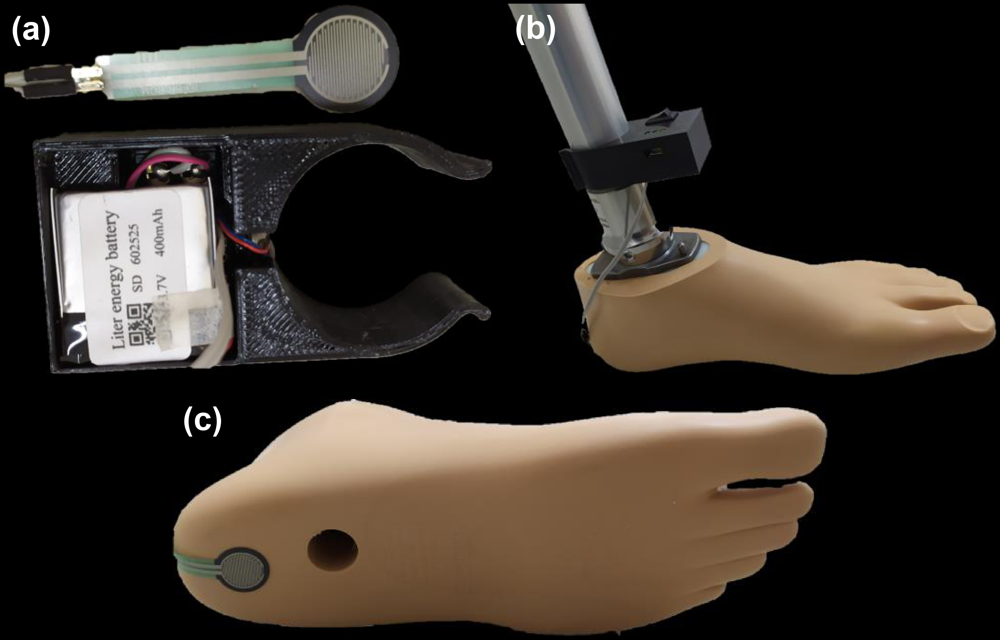
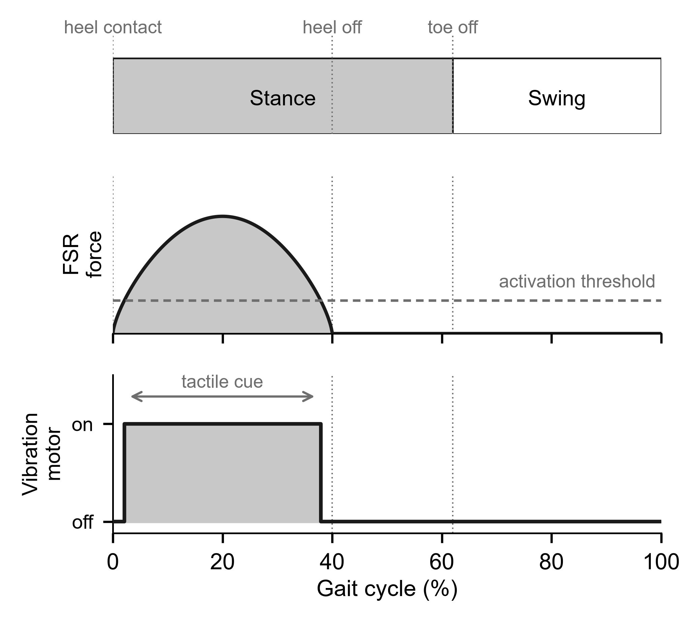
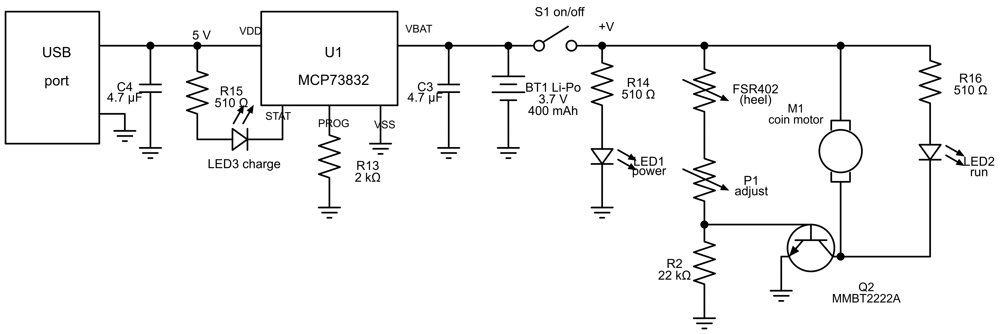

# Vibrotactile Feedback Device for Transfemoral Prostheses

Open design files for a **low-cost, fully analog vibrotactile feedback add-on** for transfemoral (above-knee) prostheses. A force-sensing resistor under the heel of the prosthetic foot switches a coin vibration motor mounted on the prosthetic tube, signaling foot–ground contact to the user at every step. The device clamps onto existing prostheses — **no structural modification, no software, no microcontroller**.

## How it works

Loading the heel-mounted force-sensing resistor (FSR) above an adjustable threshold drives a small-signal NPN transistor into saturation, switching the coin motor on for the loading and mid-stance period of the prosthetic limb.

Circuit (as used in the user study; reconstructed from the design files):

- **Charging:** MCP73832 constant-current/constant-voltage controller, 500 mA (set by the 2 kΩ program resistor), USB input.
- **Power:** single Li-Po cell, 3.7 V / 400 mAh; on/off switch on the battery rail; ≈50 mA total draw → ≈8 h continuous use.
- **Sensing/actuation:** FSR402 (heel) in series with an adjustment potentiometer (P1) against a fixed 22 kΩ pulldown, driving an MMBT2222A that switches the coin-type ERM motor (10 mm × 3 mm, ~150 Hz nominal). Turning P1 raises the activation threshold and can attenuate the vibration.
- **Indicators:** charge (LED3), power-on (LED1), motor activity (LED2).

## Repository contents

| Path | Contents |
|---|---|
| `hardware/pcb/` | Gerber fabrication files, BOM (with LCSC part numbers), pick-and-place, netlist, PCB layout PDF, 3D STEP of the board, EasyEDA Pro project |
| `hardware/schematic/` | Clean schematic (PNG) |
| `enclosure/` | 3D-printable enclosure with C-shaped interference-fit clamp for the prosthetic tube *(files being added)* |
| `docs/photos/` | Prototype photos, block diagram, operating principle |

## Cost

Quoted at a mainstream turnkey PCB assembly service (JLCPCB, Aug. 2026), batch of **5 assembled boards**:

| Item | 5-board batch | Per board |
|---|---|---|
| Components (9 line items) | US$ 7.10 | **< US$ 1.50** |
| PCB fabrication | US$ 4.00 | US$ 0.80 |
| Assembly, setup, stencil, fees | US$ 28.52 (incl. components) | — |
| **Total (PCB + assembly)** | **US$ 32.52** | **≈ US$ 6.50** |

Setup fees dominate at this batch size; the per-unit cost approaches the component cost at volume. Off-board parts (FSR402 sensor, coin motor, battery, switch, potentiometer, wiring) and the 3D-printed enclosure are not included in the quote. The charge-management IC (MCP73832) accounts for most of the component cost.

## Building one

1. **PCB:** upload `hardware/pcb/Gerber_*.zip`, the BOM, and the pick-and-place file to a turnkey assembly service (e.g., JLCPCB), or fabricate the board and hand-solder — all parts are mass-market components.
2. **Off-board parts:** FSR402 force-sensing resistor, C1026B-class coin ERM motor (10 × 3 mm), 3.7 V/400 mAh Li-Po cell (602525 or similar), slide switch, small potentiometer, hook-up wire.
3. **Enclosure:** print the model in `enclosure/`; the C-clamp fits the prosthetic tube by interference — no tools or screws.
4. **Mounting:** fix the FSR to the plantar surface of the prosthetic foot at the heel region (thin adhesive tape); clamp the enclosure to the distal portion of the prosthetic tube — the coin motor, seated in the enclosure's recess, is pressed against the tube automatically; route the sensor cable along the prosthesis.
5. **Setup:** switch on, confirm the wearer perceives the vibration at the residual limb/socket interface, and adjust P1 so the motor activates on weight bearing at a comfortable intensity.

## Status and evidence

This is a **research prototype**. In a bench test referenced to ISO 2631-1, the vibration transmitted to the socket region measured 0.48 ± 0.06 m/s². In a cross-sectional study at IMREA HC-FMUSP (research ethics approval CAAE 75258523.9.0000.0068), ten experienced transfemoral prosthesis users wore the device during a supervised ~5-min walk: all perceived the stimulus, no device-related adverse events occurred, and all eight B-QUEST 2.0 device items reached a median score of 5/5. **No clinical outcome (gait, balance, proprioception) has been evaluated yet**; a controlled study with three-dimensional gait analysis is planned.

A preliminary account of the device concept and bench measurements appeared in:

> Tamashiro, D.S.U., Coelho, D.B., Battistella, L.R. (2025). *Development of a Proprioceptive Stimulation Device to Gait in Transfemoral Amputees.* In: XXIX Brazilian Congress on Biomedical Engineering (CBEB 2024), IFMBE Proceedings, vol. 125. Springer, Cham. https://doi.org/10.1007/978-3-031-93646-3_1

A full journal manuscript (complete technical description, bench characterization, and the user satisfaction study) is under preparation/submission; this repository accompanies it.

## Known limitations of this board revision

Review these before building or deriving from this design:

1. **USB-C CC pulldowns are absent.** Only VBUS (A9/B9) and GND (A12/B12) are connected; CC1/CC2 float and there are no 5.1 kΩ pulldowns. Consequence: the board charges normally from a USB-A→USB-C cable, but **will not receive power from USB-C→USB-C cables or USB-C (PD) chargers**. Next revision: add two 5.1 kΩ 0402 resistors, CC1→GND and CC2→GND.
2. **Charge current is 1.25C for the specified cell.** R13 = 2 kΩ programs the MCP73832 to 500 mA, above the standard 1C rating of the 400 mAh cell. Next revision: R13 = 3.3 kΩ (≈300 mA, ≈0.75C) — or keep 2 kΩ only with cells ≥500 mAh. Use only protected Li-Po cells.
3. **No flyback diode across the motor.** The inductive kick of the ERM motor at every turn-off stresses Q2 (adequate margin in practice, but repeated at every step). Next revision: a small Schottky or 1N4148 across the motor terminals.
4. **Motor overdrive.** The motor drive rail (3.7–4.2 V) slightly exceeds the motor's rated voltage (2.7–3.3 V); P1 can compensate by limiting base drive.
5. **Component availability.** The yellow 0603 LEDs (LED1/LED2) were low-stock at quoting time; any 0603 indicator LED substitutes directly. Choosing basic-library alternatives for the extended parts (headers, USB connector, LEDs) reduces the assembly fee.

## Disclaimer

This design is provided for **research and educational purposes**. It is **not an approved medical device** and must not be used for clinical decision-making or unsupervised patient care. Any use with patients must be conducted under appropriate ethical approval and professional supervision.

## License

Released under **CC BY 4.0** (see `LICENSE`). You may use, modify, and redistribute, with attribution — please cite the CBEB chapter above (see `CITATION.cff`).

## Authors

Daniel Seiei Uehara Tamashiro¹·², Gustavo Shimabukuro Marchini², Daniel Boari Coelho¹, Linamara Rizzo Battistella²
¹ Biomedical Engineering, Universidade Federal do ABC (UFABC), Brazil · ² Instituto de Medicina Física e Reabilitação, HCFMUSP, Universidade de São Paulo, Brazil

Contact: daniel.tamashiro@hc.fm.usp.br
