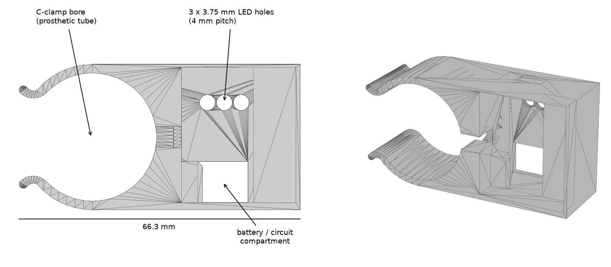

# Enclosure (3D-printable)

3D-printable housing that holds the battery and the circuit board and clamps onto the distal prosthetic tube. Two features make the assembly tool-free:

- **C-shaped clamp** — snaps onto the tube by interference fit; no screws, no structural modification of the prosthesis.
- **Motor recess** — the coin motor seats in a recess facing the tube, so closing the clamp automatically presses the motor against the prosthesis. There is no separate motor mounting step, and the vibration is injected directly into the prosthesis structure.

The outer face carries **three ⌀3.75 mm holes on a 4 mm pitch**, so that discrete (through-hole) indicator LEDs can be soldered to sit flush with the surface: charging, power-on, and motor activity stay visible with the device closed.

## Files

| File | Format |
|---|---|
| `enclosure_v6.stl` | mesh, ready to slice |
| `enclosure_v6.SLDPRT` | SolidWorks part, for editing |

## Measured dimensions (from the mesh)

| Feature | Value |
|---|---|
| Overall envelope | 66.3 × 21.0 × 34.3 mm |
| C-clamp bore | ⌀ ≈ 33.6 mm |
| LED holes | 3 × ⌀3.75 mm, 4 mm pitch |
| Outer face thickness at the LED holes | ≈ 2 mm |
| Complete device mass (enclosure + battery + circuit + motor + sensor) | 22 g |

## Printing notes

Standard FDM settings are sufficient. The clamp relies on the elasticity of the print for its interference fit, so orient the part such that layer lines do not run perpendicular to the clamp arms — otherwise the arms tend to delaminate when snapped onto the tube. Verify the bore against the tube you are targeting before printing a batch (the modular standard is 30 mm; the bore in this model is larger and was matched to the tube used in our prototype), and adjust the diameter in the SolidWorks part if needed.
